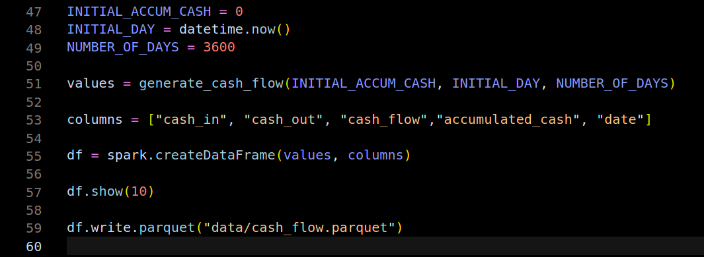

# **Boas vindas ao Flow of Cash!**

Para executar o script observe as orientações descritas a seguir e se tiver qualquer dúvida, sugestão, contribuição, considere abrir uma issue ou entrar em contato. 🚀

O objetivo é testar o .NET no Apache Spark através de um aplicativo de console, com um exemplo de leitura e tratamento simples de arquivo parquet utilizando o C# como linguagem.


# Orientações


<details>
  <summary><strong>Estrutura das pastas</strong></summary><br />

  O diretório [**Code**](Code) tem um arquivo com o exemplo das dependências necessárias (arquivo FlowOfCash.csproj) e código do tratamento do arquivo parquet (arquivo Program.cs) que é utilizado na execução da aplicação.

  E o diretório [**sample-generator**](sample-generator) tem o código python utilizado para criação dos arquivos parquet usados como exemplo, bem como a amostra em si.

  Por ser uma solução de big data, sinta-se á vontade para alterar o tamanho do sample à partir do código, para explorar o Spark agregado ao .NET.

---

  <br/>
</details>


<details>
  <summary><strong>Pré requisitos</strong></summary><br />

  O ambiente para execução do código requer as seguintes ferramentas:

  * **.Net**

  * **Java**

  * **Apache Spark**

  * **Microsoft.Spark.Worker**

  [Essa documentação](https://learn.microsoft.com/pt-br/previous-versions/dotnet/spark/tutorials/get-started?tabs=linux&WT.mc_id=dotnet-35129-website) orienta como instalá-las no Windows, Mac e Linux e foi também a base para esse projeto. 
  
  Para uso do Apache Spark no Linux e Mac, os seguintes passos [desse site](https://www.vultr.com/docs/install-apache-spark-on-ubuntu-20-04/?utm_source=performance-max-latam&utm_medium=paidmedia&obility_id=17096555207&utm_adgroup=&utm_campaign=&utm_term=&utm_content=&gclid=CjwKCAjwxaanBhBQEiwA84TVXJ_-wFrxQKfGLVBbsUzhulDxIuDdXzyuF6gKLw5UVoPJeG94eaU0wRoCcuMQAvD_BwE)podem ser úteis, também os [arquivos de distribuição disponíveis](https://archive.apache.org/dist/spark/)

  Um ponto de atenção é que no momento de criação desse repositório a versão mais recente do Spark compatível com o .NET foi a **3.2.1** (que é usada aqui). 

  Também foram utilizadas a **versão 6.0 do .NET** e **2.1.1 do .NET on Spark**.

  No repositório oficial do .NET no Spark ([link aqui](https://github.com/dotnet/spark/tree/main/docs/release-notes)) é possível verificar a compatibilidade entre as dependências para efetuar corretamente as instalações dos componentes necessários.

---

  <br/>
</details>

<details>
  <summary><strong>(Opcional) Modificando o sample</strong></summary><br />

  Com o python e o pip instalado, entre no diretório [**sample-generator**](sample-generator) e siga os seguintes passos:
  
  1º (Recomendado) Crie um ambiente virtual do python para isolar a execução do projeto das dependências da sua máquina:

  ```bash
  python3 -m venv sample-generator
  source sample-generator/bin/activate
  ```

  Caso tenha sucesso, deve ser criado o diretório **sample-generator**.

  2º Instale as dependências do script python com o comando:

  ```bash
  pip install -r requirements.txt
  ```

  3º (Opcional) Para alterar a quantidade de registros a serem gerados, modifique o valor da linha 49 do arquivo `generator.py` como demonstrado na imagem abaixo:


  ### **Imagem 01 - Alterando a quantidade de registros do arquivo parquet.**
  

  4º Com os passos anteriores, execute o comando para gerar os arquivos parquet:

  ```bash
  python generator.py
  ```


</details>

<details>
  <summary><strong>Como executar o código</strong></summary><br />

  Com as instalações dos pré requisitos feitas e o clone desse repositório, siga os seguintes passos:
  
  1º Navegue via seu terminal até a pasta clonada e abra o diretório **dotnet-on-spark**. Dentro do diretório execute o seguinte comando:

  ```csharpe
  dotnet new console -o FlowOfCash
  ```

  Caso tenha sucesso, deve ser criado o diretório **FlowOfCash**.

  2º Da pasta [**Code**](Code) copie o arquivo **_Program.cs_** e substitua o criado no diretório **FlowOfCash**.

  3º Dentro do diretório **FlowOfCash**. execute os seguintes comandos em ordem:

  ```csharpe
  dotnet add package Microsoft.Spark
  dotnet build
  ```

  Se executado com êxito, o diretório **bin** deve ser criado.

  4º Navegue até o arquivo de execução criado através do seguinte comando:

  ```bash
  cd bin/Debug/net6.0 
  ```

  Sendo net6.0 a versão utilizada nesse projeto. Caso tenha uma versão diferente em sua máquina substitua o valor da versão pela correspondente.

  5º Dentro da pasta, execute o seguinte comando no terminal:

  ```spark
spark-submit \
--class org.apache.spark.deploy.dotnet.DotnetRunner \
--master local \
microsoft-spark-3-2_2.12-2.1.1.jar \
dotnet FlowOfCash.dll <caminho-do-clone-do-repositorio/dotnet-on-spark/sample-generator/data/cash_flow.parquet

  ```

  Sendo **_microsoft-spark-3-2_2.12-2.1.1.jar_** a versão compatível do Spark com Microsoft.Spark.Worker utilizada. Caso use uma versão do Spark 3.1.2 altere para a versão compatível do worker.
  
  Também substitua o início do caminho do diretório do arquivo parquet pelo caminho do clone do repositório.

  Caso executado com êxito deve ser possível visualizar os seguintes resultados:

  * O conteúdo do arquivo parquet;
  * O tratamento feito à partir dos dados do arquivo;
  * O último valor da coluna de caixa acumulado (**accumulated_cash**).

</details>


<details>
  <summary><strong>Próximos passos</strong></summary><br />

  Por se tratar de um primeiro contato com o .NET on spark e tendo objetivo de registrar os estudos a respeito dele, alguns pontos fundamentais serão revisitados nesse código:

  * **Definição de padrão de projeto** para desaclopar o código executor da leitura e transformação dos arquivos;

  * **Testes unitários** para garantir o design e confiabilidade do código construído;

  * **Utilização de outras APIs do Spark no contexto do .NET**, para revisitar a linguagem e explorar soluções de machine learning, integração com spark sql, etc...

  Caso tenha interesse, considere clonar e ajudar a explorar essa solução.

</details>

---
